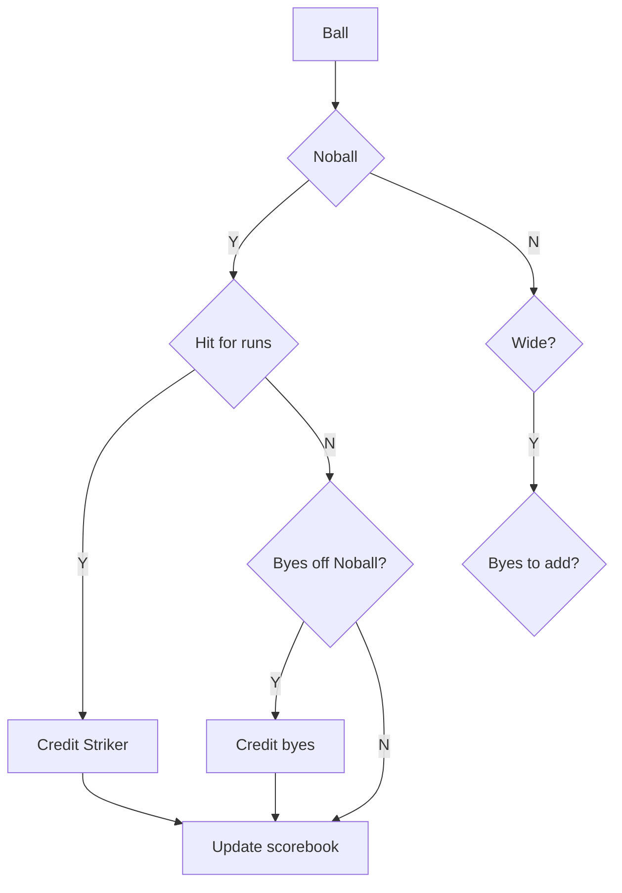

# Ball Evaluation

```mermaid
flowchart
    Ball --> isNoball
    isNoball{Noball ?}-->|Y| noballRunsScored
    noballRunsScored{Hit for runs}-->|Y| addNoballRuns
    noballRunsScored{Hit for runs}-->|N| ranNoballByes
    ranNoballByes{Byes off Noball?}-->|Y| addNoballByes
    ranNoballByes{Byes off Noball?}-->|N| justANoball
    addNoballRuns[Credit Striker]-->justANoball
    addNoballByes[Credit byes]-->justANoball
    justANoball[Update scorebook]

    isNoball{Noball}-->|N| isAWide
    isAWide{Wide?}-->|Y| wideRunsScored
    wideRunsScored{Byes to add?}

```
