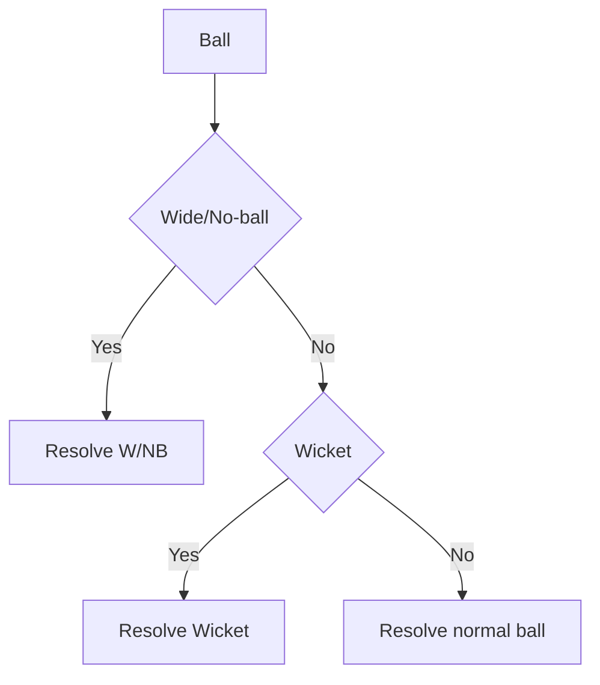

# Ball Evaluation

```mermaid
flowchart
    Ball --> WNB
    WNB{Wide/No-ball}-->|Yes| DoWNB[Resolve W/NB]
    WNB --> |No| Wkt{Wicket}
    Wkt --> |Yes| DoWKt[Resolve Wicket]
    Wkt --> |No| Normal[Resolve normal ball]
```