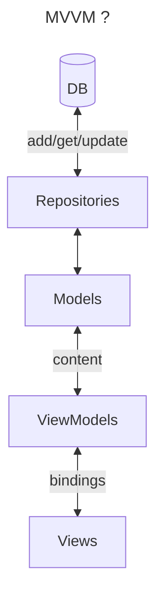

# Architecture

## TODOs

### Player Selector

* need to be able to search for a player who hasn't already played for the team. Or possibly create a player not already in the database at all
* selecting players other than defaults (or unselecting defaults) doesn't affect the team list for the innings
