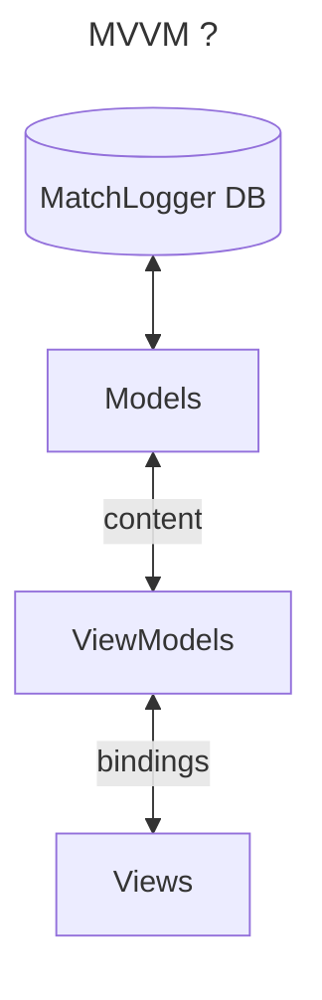

# Architecture

```mermaid
---
title: MVVM ?
---
flowchart
    db[(MatchLogger DB)]
    models[Models]
    vms[ViewModels]
    views[Views]
    db <--> models
    models <-- content --> vms
    vms <-- bindings --> views
```